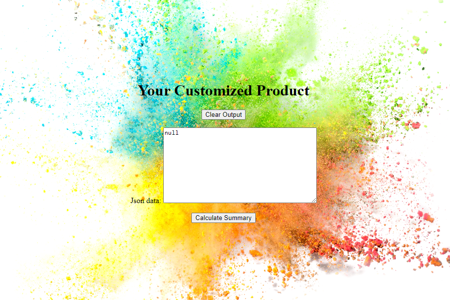
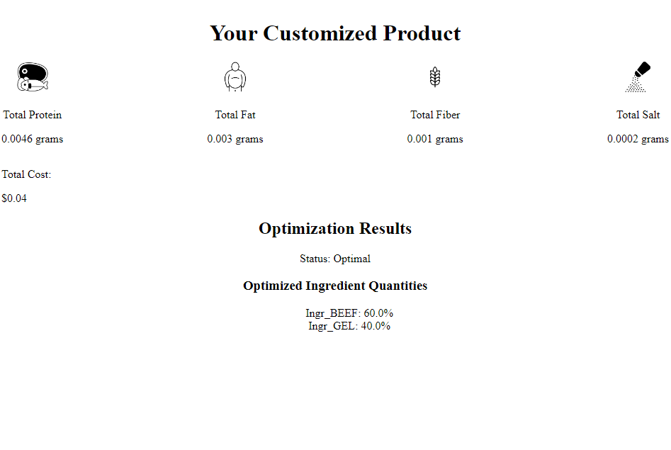

# BLENDING-PROBLEM

## Introduction

This is a web-based application project developed in django framework, and mathematical solver Pulp.This project's main goal is to meet a factory need to produce a product as cheaply as possible while ensuring it meets the certain requirements. Thus they want to vary the quantities of each raw material/ ingredients used (the main raw material/ingredients being A, B, C, D, E and F) while still meeting their product standards. It has a simple and pleasant user interface with the help of CSS and HTML scripting Framework that  gives the management or end-users a better experience while using the application.

## Problem Description

The costs of the chicken, beef, and mutton are $0.013, $0.008 and $0.010 respectively, while the costs of the rice, wheat and gel are $0.002, $0.005 and $0.001 respectively. (All costs are per gram.) For this exercise we will ignore the vitamin and mineral ingredients. (Any costs for these are likely to be very small anyway.)

Each ingredient contributes to the total weight of protein, fat, fibre and salt in the final product. The contributions (in grams) per gram of ingredient are given in the table below.

Running this project should then produce the optimal solution that Beef will make up 60%, Gel will make up 40% and the Total cost of ingredients per can is 52 cents.

## Problem Description
Whiskas cat food, shown above, is manufactured by Uncle Ben’s. Uncle Ben’s want to produce their cat food products as cheaply as possible while ensuring they meet the stated nutritional analysis requirements shown on the cans. Thus they want to vary the quantities of each ingredient used (the main ingredients being chicken, beef, mutton, rice, wheat and gel) while still meeting their nutritional standards.

## About the Blending Problem Solver Webapp

This project was developed using the following:
Python Django==4.2.4
MySQL Database
HTML
CSS
JavaScript
PuLp

## DEMO  VIDEO

[Link to YouTube Shorts](https://youtube.com/shorts/c9ri8U3E2eQ)

